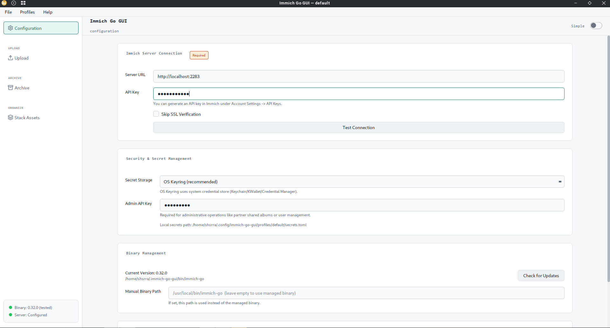
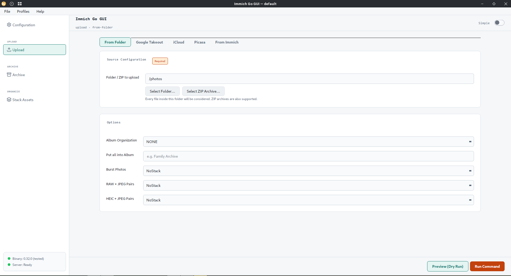
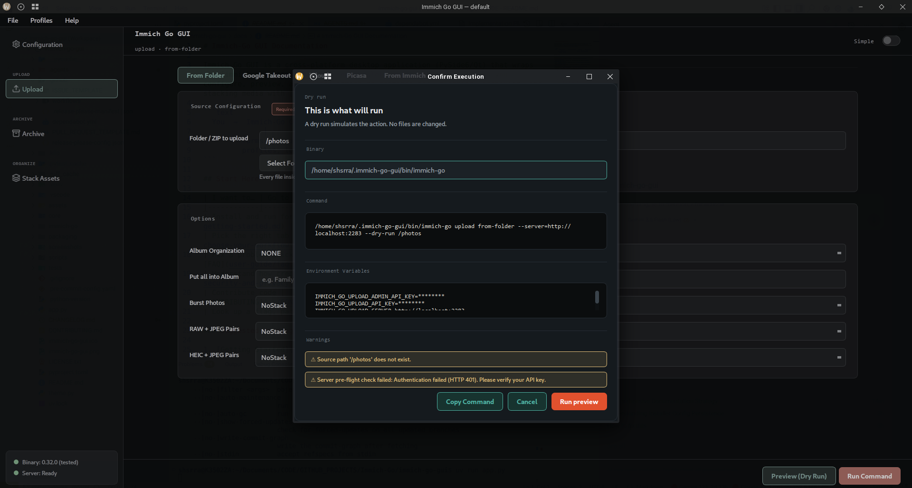
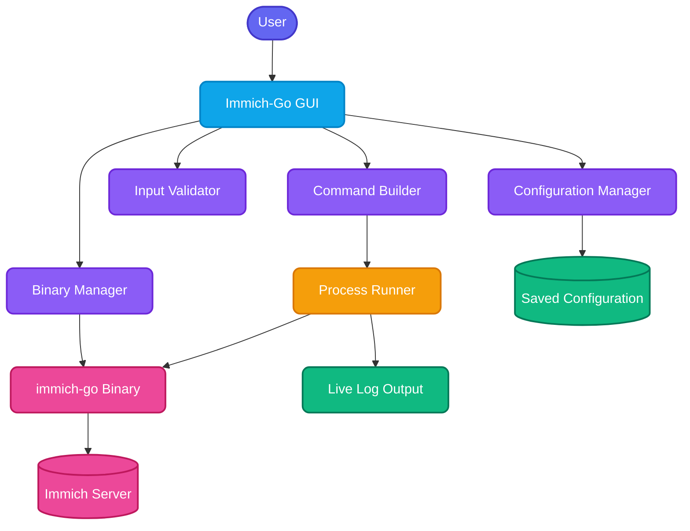

# Immich-Go GUI

[](https://opensource.org/licenses/MIT)
[](https://www.python.org/downloads/)
[](https://github.com/simulot/immich-go)
[](docs/README.md)

A cross-platform desktop front-end for [immich-go](https://github.com/simulot/immich-go) — configure workflows with forms, preview the exact command, and launch it in a real terminal against your [Immich](https://immich.app/) server.





## Why this exists

immich-go is powerful but flag-heavy. Immich-Go GUI gives you:

- **11 workflow tabs** covering every current immich-go upload / archive / stack subcommand
- **Safe defaults** — API keys in the OS keyring, secrets via environment variables, masked previews
- **Profiles** for home vs work (or staging vs production) Immich servers
- **Pre-flight checks** so you discover connection problems before a long job starts
- **Automatic immich-go downloads** with SHA256 verification

New here? Start with **[docs/](docs/README.md)** — especially [Choose Your Workflow](docs/user-guide/choose-your-workflow.md) and [Getting Started](docs/user-guide/getting-started.md).

## Features

| Area | Highlights |
|------|------------|
| **Workflows** | Upload & archive from folder, Google Photos, iCloud, Picasa, Immich; plus Stack |
| **Config** | Multi-profile settings, themes (system/light/dark), preferred terminal |
| **Safety** | Keyring secrets, env delivery, SSL warnings, process locks, dry-run |
| **CLI parity** | Simple mode for common fields; advanced mode for full flag surface |
| **Ops** | Binary manager, connection test, command preview, drag-and-drop paths |
| **Platforms** | Windows installer/portable, macOS DMG, Linux AppImage/DEB/RPM/tarball |

## Architecture Overview



## Download & Installation

### Pre-built binaries (recommended)

Grab the latest build from the [Releases page](https://github.com/shitan198u/immich-go-gui/releases/latest):

| Platform | Recommended package |
|----------|---------------------|
| Windows | `Immich-Go-GUI-{VERSION}-Windows-x86_64-Setup.exe` (or `…-Portable.zip`) |
| macOS | `Immich-Go-GUI-{VERSION}-macOS-x86_64.dmg` |
| Linux | `Immich-Go-GUI-{VERSION}-Linux-x86_64.AppImage` (also `.deb` / `.rpm` / `.tar.gz`) |

Platform-specific tips (Gatekeeper, AppImage `chmod`, Defender false positives): **[Platform Notes](docs/user-guide/platform-notes.md)**.

> **Windows antivirus note:** Defender or VirusTotal may flag the unsigned Nuitka build (e.g. `Trojan:Win32/Wacatac.B!ml`). This is a common **false positive**. Prefer official GitHub Releases, or run from source below.

### Run from source

**Prerequisites:** Python **3.13** (`>=3.13.0, <3.14`) and [uv](https://docs.astral.sh/uv/getting-started/installation/).

```bash
git clone https://github.com/shitan198u/immich-go-gui.git
cd immich-go-gui
uv sync --dev
uv run app.py
```

On first use, the Config tab can download a compatible immich-go binary for you.

## Documentation

Full guides live under **[docs/](docs/README.md)**:

| Audience | Start here |
|----------|------------|
| **Users** | [Getting Started](docs/user-guide/getting-started.md) · [Choose Your Workflow](docs/user-guide/choose-your-workflow.md) · [FAQ](docs/user-guide/faq.md) |
| **Operators** | [Configuration](docs/user-guide/configuration.md) · [Security](docs/user-guide/security-and-privacy.md) · [Troubleshooting](docs/user-guide/troubleshooting.md) |
| **Developers** | [Architecture](docs/developer-guide/architecture.md) · [Testing](docs/developer-guide/testing.md) · [CONTRIBUTING](CONTRIBUTING.md) |
| **Reference** | [CLI mapping](docs/reference/cli-command-mapping.md) · [Config schema](docs/reference/config-schema.md) · [Env vars](docs/reference/environment-variables.md) |

Version history: [CHANGELOG.md](CHANGELOG.md).

## Immich-Go Integration

This GUI targets immich-go **0.32.0** (tested). CLI behavior, edge cases, and flag semantics are defined upstream:

https://github.com/simulot/immich-go/

Compatibility policy: [docs/reference/immich-go-compatibility.md](docs/reference/immich-go-compatibility.md).

## Contributing

Contributions are welcome. Please:

1. Read [CONTRIBUTING.md](CONTRIBUTING.md)
2. Skim the [Developer Guide](docs/developer-guide/architecture.md)
3. Open PRs against **`staging`** (not `master`)
4. Prefer [Conventional Commits](https://www.conventionalcommits.org/) (`feat:`, `fix:`, `docs:`, …) so Release Please can version cleanly

```bash
uv sync --dev
uv run pytest
```

## Support

If Immich-Go GUI saves you time, you can support development:

### GitHub Sponsors

[](https://github.com/sponsors/shitan198u)

### Buy Me a Coffee

[](https://www.buymeacoffee.com/shivashitan)

## License


