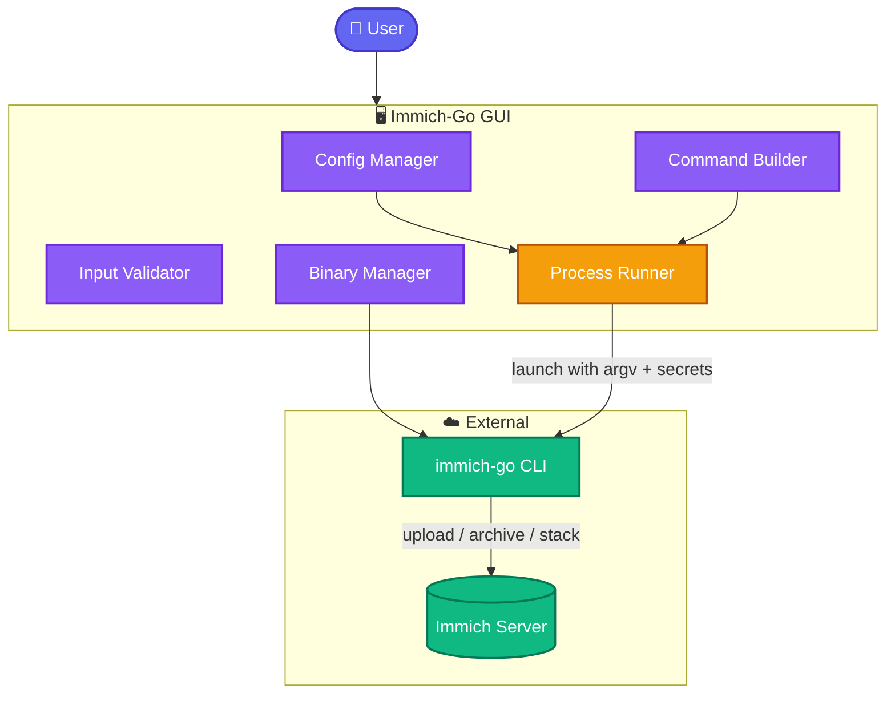

# Immich-Go GUI Documentation

Immich-Go GUI is a cross-platform desktop application (PySide6/Qt) that wraps the [immich-go](https://github.com/simulot/immich-go) CLI. It helps you configure, preview, and launch immich-go commands for uploading, archiving, and stacking media with [Immich](https://immich.app/).

## Start Here

| I want to… | Go to |
|------------|--------|
| Install and run for the first time | [Getting Started](user-guide/getting-started.md) |
| Pick the right tab for my library | [Choose Your Workflow](user-guide/choose-your-workflow.md) |
| Fix a problem quickly | [Troubleshooting](user-guide/troubleshooting.md) · [FAQ](user-guide/faq.md) |
| Understand how credentials are handled | [Security & Privacy](user-guide/security-and-privacy.md) |
| Contribute code | [Architecture](developer-guide/architecture.md) · [CONTRIBUTING](../CONTRIBUTING.md) |
| Look up a flag, path, or env var | [Reference](#reference) |

## System Architecture

### Suggested reading order (new users)

1. [Getting Started](user-guide/getting-started.md)
2. [Platform Notes](user-guide/platform-notes.md) for your OS
3. [Configuration](user-guide/configuration.md)
4. [Choose Your Workflow](user-guide/choose-your-workflow.md)
5. The specific workflow page (Upload / Archive / Stack)
6. Bookmark [Troubleshooting](user-guide/troubleshooting.md) and [FAQ](user-guide/faq.md)

### Suggested reading order (contributors)

1. [Architecture](developer-guide/architecture.md)
2. [Core Modules](developer-guide/core-modules.md)
3. [Testing](developer-guide/testing.md)
4. [Adding Tabs and Flags](developer-guide/adding-tabs-and-flags.md)
5. [CI/CD and Releases](developer-guide/ci-cd-and-releases.md)

---

## User Guide

| Document | Description |
|----------|-------------|
| [Getting Started](user-guide/getting-started.md) | Install binaries or run from source; first-run tour |
| [Platform Notes](user-guide/platform-notes.md) | Windows / macOS / Linux install quirks and paths |
| [Choose Your Workflow](user-guide/choose-your-workflow.md) | Decision tree and common recipes |
| [Configuration](user-guide/configuration.md) | Server, API keys, binary manager, themes, admin key |
| [Profiles](user-guide/profiles.md) | Multi-server / multi-environment setups |
| [Upload Workflows](user-guide/upload-workflows.md) | Folder, Google Photos, iCloud, Picasa, Immich → Immich |
| [Archive Workflows](user-guide/archive-workflows.md) | Local export tabs + Archive from Immich |
| [Stack](user-guide/stack.md) | Burst / RAW / HEIC stacking on the server |
| [Advanced Flags](user-guide/advanced-flags.md) | Simple vs advanced mode; per-tab flags |
| [Security & Privacy](user-guide/security-and-privacy.md) | Keyring, env secrets, SSL, threat model |
| [Troubleshooting](user-guide/troubleshooting.md) | Locks, terminals, SSL, antivirus, 403s |
| [FAQ](user-guide/faq.md) | Short answers to common questions |
| [Glossary](user-guide/glossary.md) | Shared vocabulary |

## Developer Guide

| Document | Description |
|----------|-------------|
| [Architecture](developer-guide/architecture.md) | UI vs core split, data flow, security model |
| [Core Modules](developer-guide/core-modules.md) | Module-by-module `core/` reference |
| [Adding Tabs and Flags](developer-guide/adding-tabs-and-flags.md) | Extend CLI parity safely |
| [Testing](developer-guide/testing.md) | pytest, fixtures, headless Qt, `_norm_argv` |
| [CI/CD and Releases](developer-guide/ci-cd-and-releases.md) | Branching, Release Please, packaging |
| [Scripts](developer-guide/scripts.md) | CLI help capture and review utilities |

## Reference

| Document | Description |
|----------|-------------|
| [Config Schema](reference/config-schema.md) | TOML fields, OS paths, overrides |
| [Environment Variables](reference/environment-variables.md) | `IMMICH_GO_*` secret and server env map |
| [CLI Command Mapping](reference/cli-command-mapping.md) | 11 GUI tabs → immich-go subcommands |
| [immich-go Compatibility](reference/immich-go-compatibility.md) | Tested versions, download, SHA256 |

## Related Project Files

| File | Purpose |
|------|---------|
| [README](../README.md) | Project landing page |
| [CONTRIBUTING](../CONTRIBUTING.md) | How to contribute |
| [CHANGELOG](../CHANGELOG.md) | Version history |
| [LICENSE](../LICENSE.txt) | MIT license |

---

**Version note:** Docs track the application as of **v1.1.2**, tested with **immich-go 0.32.0**. If something in the UI disagrees with a page, prefer the running app and open an issue or PR.
