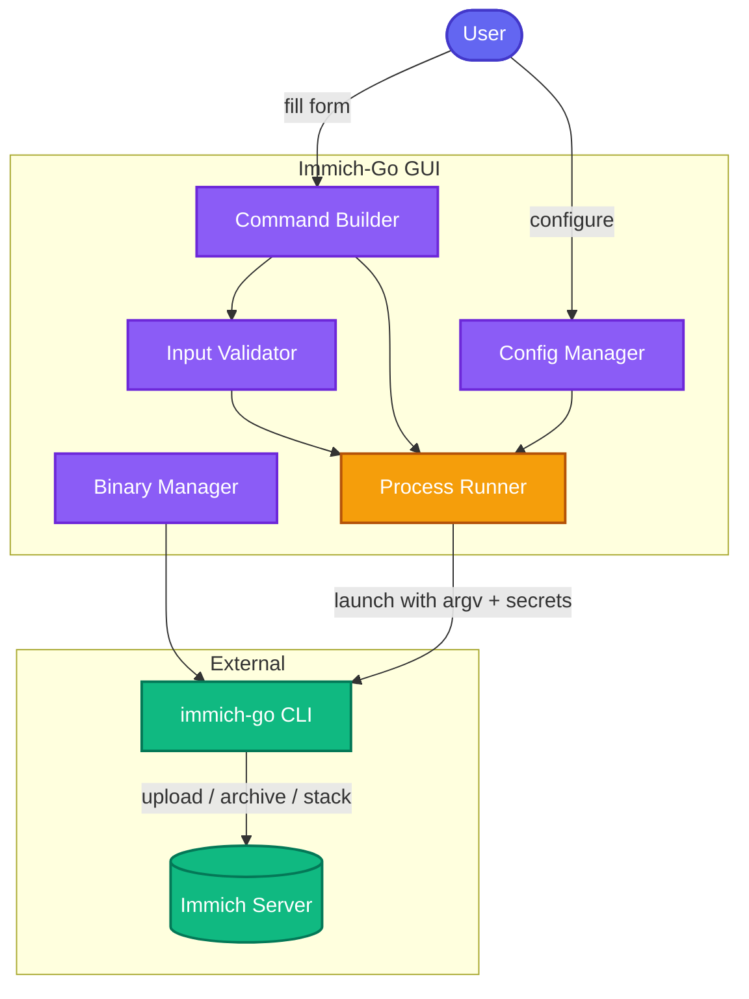

---
hide:
  - navigation
  - toc
---

Desktop GUI · Open Source · Cross-platform

# Immich-Go GUI

A beautiful desktop GUI for <a href="https://github.com/simulot/immich-go">immich-go</a> —
bulk upload, archive, and stack your media with <a href="https://immich.app/">Immich</a>.

[Get Started](user-guide/getting-started.md){ .md-button .md-button--primary }
[Choose Your Workflow](user-guide/choose-your-workflow.md){ .md-button }
[Downloads](https://github.com/shitan198u/immich-go-gui/releases/latest){ .md-button }

:fontawesome-brands-windows: Windows · :fontawesome-brands-apple: macOS · :fontawesome-brands-linux: Linux

Immich-Go GUI is a cross-platform desktop application (PySide6/Qt) that wraps the [immich-go](https://github.com/simulot/immich-go) CLI. Configure jobs with forms, preview the exact command, and launch bulk media operations against your [Immich](https://immich.app/) server — without memorizing a forest of flags.

## Why Immich-Go GUI?

  

    
<svg xmlns="http://www.w3.org/2000/svg" width="28" height="28" viewBox="0 0 24 24" fill="none" stroke="currentColor" stroke-width="2" stroke-linecap="round" stroke-linejoin="round"><path d="M21 15v4a2 2 0 0 1-2 2H5a2 2 0 0 1-2-2v-4"/><polyline points="17 8 12 3 7 8"/><line x1="12" y1="3" x2="12" y2="15"/></svg>

    <h3>Full workflow coverage</h3>
    
Eleven tabs for every upload, archive, and stack path — folder, Google Photos, iCloud, Picasa, Immich-to-Immich, and more.

  

  

    
<svg xmlns="http://www.w3.org/2000/svg" width="28" height="28" viewBox="0 0 24 24" fill="none" stroke="currentColor" stroke-width="2" stroke-linecap="round" stroke-linejoin="round"><rect x="3" y="11" width="18" height="11" rx="2" ry="2"/><path d="M7 11V7a5 5 0 0 1 10 0v4"/></svg>

    <h3>Secrets done right</h3>
    
API keys live in the OS keyring, travel as environment variables, and stay masked in previews and logs.

  

  

    
<svg xmlns="http://www.w3.org/2000/svg" width="28" height="28" viewBox="0 0 24 24" fill="none" stroke="currentColor" stroke-width="2" stroke-linecap="round" stroke-linejoin="round"><path d="M17 21v-2a4 4 0 0 0-4-4H5a4 4 0 0 0-4 4v2"/><circle cx="9" cy="7" r="4"/><path d="M23 21v-2a4 4 0 0 0-3-3.87"/><path d="M16 3.13a4 4 0 0 1 0 7.75"/></svg>

    <h3>Multi-server profiles</h3>
    
Home vs work, staging vs production — switch Immich targets without re-entering credentials each time.

  

  

    
<svg xmlns="http://www.w3.org/2000/svg" width="28" height="28" viewBox="0 0 24 24" fill="none" stroke="currentColor" stroke-width="2" stroke-linecap="round" stroke-linejoin="round"><path d="M22 11.08V12a10 10 0 1 1-5.93-9.14"/><polyline points="22 4 12 14.01 9 11.01"/></svg>

    <h3>Pre-flight safety</h3>
    
Connection tests, dry-run, process locks, and SHA256-verified binary downloads before long jobs start.

  

  

    
<svg xmlns="http://www.w3.org/2000/svg" width="28" height="28" viewBox="0 0 24 24" fill="none" stroke="currentColor" stroke-width="2" stroke-linecap="round" stroke-linejoin="round"><line x1="4" y1="21" x2="4" y2="14"/><line x1="4" y1="10" x2="4" y2="3"/><line x1="12" y1="21" x2="12" y2="12"/><line x1="12" y1="8" x2="12" y2="3"/><line x1="20" y1="21" x2="20" y2="16"/><line x1="20" y1="12" x2="20" y2="3"/><line x1="1" y1="14" x2="7" y2="14"/><line x1="9" y1="8" x2="15" y2="8"/><line x1="17" y1="16" x2="23" y2="16"/></svg>

    <h3>Simple & advanced modes</h3>
    
Friendly defaults for common fields, with a full flag surface when you need power-user control.

  

  

    
<svg xmlns="http://www.w3.org/2000/svg" width="28" height="28" viewBox="0 0 24 24" fill="none" stroke="currentColor" stroke-width="2" stroke-linecap="round" stroke-linejoin="round"><polyline points="4 17 10 11 4 5"/><line x1="12" y1="19" x2="20" y2="19"/></svg>

    <h3>Real terminal launches</h3>
    
Jobs open in your preferred terminal so progress, errors, and resumes stay visible and inspectable.

  

## See it in action

  <a href="assets/screenshot-1.png">
    
    Main Window
  </a>
  <a href="assets/screenshot-2.png">
    
    Workflow Tab
  </a>
  <a href="assets/screenshot-3.png">
    
    Command Preview
  </a>

## Start here

Pick the path that matches what you need right now.

  <a class="link-card" data-accent="coral" href="user-guide/getting-started/">
    First run
    <strong>Getting Started</strong>
    Install binaries or run from source, then take the first-run tour.
  </a>
  <a class="link-card" data-accent="indigo" href="user-guide/choose-your-workflow/">
    Decision help
    <strong>Choose Your Workflow</strong>
    Decision tree and recipes for folder, cloud takeouts, and server-to-server.
  </a>
  <a class="link-card" data-accent="amber" href="user-guide/troubleshooting/">
    Stuck?
    <strong>Troubleshooting</strong>
    Locks, terminals, SSL, antivirus, and 403s — fix it fast.
  </a>
  <a class="link-card" data-accent="emerald" href="user-guide/security-and-privacy/">
    Trust
    <strong>Security & Privacy</strong>
    Keyring, env secrets, SSL, and the threat model explained clearly.
  </a>
  <a class="link-card" data-accent="violet" href="developer-guide/architecture/">
    Contributors
    <strong>Architecture</strong>
    UI vs core split, data flow, and how to extend the app safely.
  </a>
  <a class="link-card" data-accent="sky" href="reference/cli-command-mapping/">
    Lookup
    <strong>CLI Command Mapping</strong>
    Every GUI tab mapped to immich-go subcommands and flags.
  </a>

## System architecture

## Suggested reading order

### New users

<ol class="reading-path">
  <li><a href="user-guide/getting-started/">Getting Started</a> — install and first launch</li>
  <li><a href="user-guide/platform-notes/">Platform Notes</a> — OS-specific paths and quirks</li>
  <li><a href="user-guide/configuration/">Configuration</a> — server, keys, binary, themes</li>
  <li><a href="user-guide/choose-your-workflow/">Choose Your Workflow</a> — pick the right tab</li>
  <li>Your workflow page — Upload / Archive / Stack</li>
  <li><a href="user-guide/troubleshooting/">Troubleshooting</a> &amp; <a href="user-guide/faq/">FAQ</a> — keep bookmarked</li>
</ol>

### Contributors

<ol class="reading-path">
  <li><a href="developer-guide/architecture/">Architecture</a></li>
  <li><a href="developer-guide/core-modules/">Core Modules</a></li>
  <li><a href="developer-guide/testing/">Testing</a></li>
  <li><a href="developer-guide/adding-tabs-and-flags/">Adding Tabs and Flags</a></li>
  <li><a href="developer-guide/ci-cd-and-releases/">CI/CD and Releases</a></li>
</ol>

---

## Documentation map

### User Guide

  <a class="link-card" data-accent="coral" href="user-guide/getting-started/">
    Setup
    <strong>Getting Started</strong>
    Install binaries or run from source; first-run tour.
  </a>
  <a class="link-card" data-accent="indigo" href="user-guide/platform-notes/">
    OS
    <strong>Platform Notes</strong>
    Windows / macOS / Linux install quirks and paths.
  </a>
  <a class="link-card" data-accent="sky" href="user-guide/choose-your-workflow/">
    Recipes
    <strong>Choose Your Workflow</strong>
    Decision tree and common library recipes.
  </a>
  <a class="link-card" data-accent="violet" href="user-guide/configuration/">
    Settings
    <strong>Configuration</strong>
    Server, API keys, binary manager, themes, admin key.
  </a>
  <a class="link-card" data-accent="emerald" href="user-guide/profiles/">
    Multi-env
    <strong>Profiles</strong>
    Multi-server and multi-environment setups.
  </a>
  <a class="link-card" data-accent="coral" href="user-guide/upload-workflows/">
    Import
    <strong>Upload Workflows</strong>
    Folder, Google Photos, iCloud, Picasa, Immich-to-Immich.
  </a>
  <a class="link-card" data-accent="amber" href="user-guide/archive-workflows/">
    Export
    <strong>Archive Workflows</strong>
    Local export tabs plus Archive from Immich.
  </a>
  <a class="link-card" data-accent="violet" href="user-guide/stack/">
    Server
    <strong>Stack</strong>
    Burst / RAW / HEIC stacking on the Immich server.
  </a>
  <a class="link-card" data-accent="indigo" href="user-guide/advanced-flags/">
    Power user
    <strong>Advanced Flags</strong>
    Simple vs advanced mode; per-tab flag reference.
  </a>
  <a class="link-card" data-accent="emerald" href="user-guide/security-and-privacy/">
    Safety
    <strong>Security & Privacy</strong>
    Keyring, env secrets, SSL, threat model.
  </a>
  <a class="link-card" data-accent="amber" href="user-guide/troubleshooting/">
    Support
    <strong>Troubleshooting</strong>
    Locks, terminals, SSL, antivirus, 403s.
  </a>
  <a class="link-card" data-accent="sky" href="user-guide/faq/">
    Q&A
    <strong>FAQ</strong>
    Short answers to the most common questions.
  </a>
  <a class="link-card" data-accent="violet" href="user-guide/glossary/">
    Terms
    <strong>Glossary</strong>
    Shared vocabulary for the project and Immich.
  </a>

### Developer Guide

  <a class="link-card" data-accent="violet" href="developer-guide/architecture/">
    Overview
    <strong>Architecture</strong>
    UI vs core split, data flow, security model.
  </a>
  <a class="link-card" data-accent="indigo" href="developer-guide/core-modules/">
    Code
    <strong>Core Modules</strong>
    Module-by-module <code>core/</code> reference.
  </a>
  <a class="link-card" data-accent="coral" href="developer-guide/adding-tabs-and-flags/">
    Extend
    <strong>Adding Tabs & Flags</strong>
    Grow CLI parity without breaking safety.
  </a>
  <a class="link-card" data-accent="emerald" href="developer-guide/testing/">
    Quality
    <strong>Testing</strong>
    pytest, fixtures, headless Qt, <code>_norm_argv</code>.
  </a>
  <a class="link-card" data-accent="amber" href="developer-guide/ci-cd-and-releases/">
    Ship
    <strong>CI/CD & Releases</strong>
    Branching, Release Please, packaging.
  </a>
  <a class="link-card" data-accent="sky" href="developer-guide/scripts/">
    Tooling
    <strong>Scripts</strong>
    CLI help capture and review utilities.
  </a>

### Reference

  <a class="link-card" data-accent="indigo" href="reference/config-schema/">
    Config
    <strong>Config Schema</strong>
    TOML fields, OS paths, and overrides.
  </a>
  <a class="link-card" data-accent="coral" href="reference/environment-variables/">
    Env
    <strong>Environment Variables</strong>
    <code>IMMICH_GO_*</code> secret and server env map.
  </a>
  <a class="link-card" data-accent="sky" href="reference/cli-command-mapping/">
    CLI
    <strong>CLI Command Mapping</strong>
    Maps all 11 GUI tabs to immich-go subcommands.
  </a>
  <a class="link-card" data-accent="emerald" href="reference/immich-go-compatibility/">
    Versions
    <strong>immich-go Compatibility</strong>
    Tested versions, download, SHA256 checks.
  </a>

### Related project files

| File | Purpose |
|------|---------|
| [README](https://github.com/shitan198u/immich-go-gui/blob/master/README.md) | Project landing page |
| [CONTRIBUTING](CONTRIBUTING.md) | How to contribute |
| [CHANGELOG](CHANGELOG.md) | Version history |
| [LICENSE](https://github.com/shitan198u/immich-go-gui/blob/master/LICENSE) | MIT license |

  <strong>Version note:</strong>
  Docs track the application as of <strong>v1.1.2</strong>, tested with <strong>immich-go 0.32.0</strong>. If something in the UI disagrees with a page, prefer the running app and open an issue or PR.

