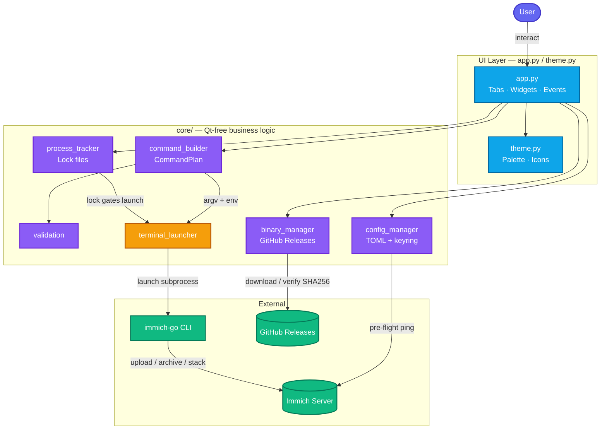
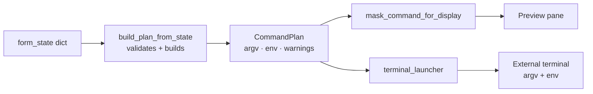
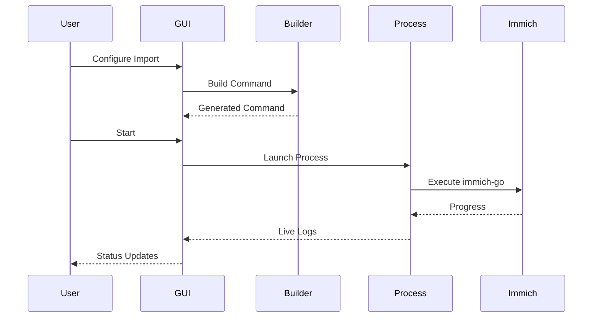

# Architecture

Immich-Go GUI is a desktop application with a deliberate separation between Qt UI code and testable business logic.

## High-Level Overview



## High-Level Structure

```text
immich-go-gui/
├── app.py                 # Qt UI: tabs, widgets, run/save/load orchestration
├── theme.py               # Theming: Fusion style, palettes, SVG icons
├── core/                  # Qt-free business logic (testable without GUI)
│   ├── models.py          # Dataclasses / enums
│   ├── cli_schema.py      # Tab keys, allowlists, env maps
│   ├── advanced_flags.py  # Advanced flag registry
│   ├── command_builder.py # state dict produces a CommandPlan
│   ├── config_manager.py  # TOML + keyring secrets
│   ├── profile_manager.py # Multi-profile index
│   ├── binary_manager.py  # immich-go download / versions
│   ├── network.py         # Pre-flight Immich checks
│   ├── process_tracker.py # Run locks
│   ├── terminal_launcher.py
│   ├── validation.py
│   ├── cli_help.py / cli_contract.py
│   └── __init__.py        # Public re-exports
├── tests/                 # pytest + pytest-qt + fixtures
├── scripts/               # CLI help capture, review bundles
├── docs/                  # User + developer + reference docs
├── packaging/             # Linux nfpm + Windows Inno Setup
└── assets/icons/          # Sidebar SVG icons
```

## Layer Responsibilities

| Layer | Files | Responsibility |
|-------|-------|----------------|
| **UI** | `app.py`, `theme.py` | Widgets, layouts, user input, visual feedback |
| **Core** | `core/*.py` | CLI schema, command building, config, binary mgmt, process locks |
| **External** | immich-go CLI, Immich API, GitHub Releases | Runtime dependencies |

The `core/` package MUST NOT import PySide6 or Qt. All network, file I/O, subprocess, and keyring operations live here so unit tests can run headlessly.

## Data Flow



### Typical Run Sequence



1. User fills form fields on a workflow tab in `app.py`.
2. `build_plan_from_state()` in `core/command_builder.py` validates input and produces a `CommandPlan` (argv + env + masked display).
3. Pre-flight check calls `core/network.py` for server-required tabs.
4. `core/process_tracker.py` creates a lock file to prevent concurrent runs.
5. `core/terminal_launcher.py` opens an external terminal running immich-go with the constructed argv and env.
6. Lock is released when the process exits (Windows uses a heartbeat helper for cleanup).

## CLI Parity Model

The GUI maintains **11/11 parity** with immich-go subcommands:

- 5 upload tabs
- 5 archive tabs
- 1 stack tab

Each tab maps to a fixed command token list in `core/cli_schema.py` (`TAB_COMMANDS`). Allowed flags per tab are defined in `TAB_ALLOWED_FLAGS` and validated at build time.

### Serverless Tab Rule

These archive tabs are classified as `SERVERLESS_TABS`:

- `archive-folder`, `archive-gp`, `archive-icloud`, `archive-picasa`

They must **never** emit `--server`, `--api-key`, or `--client-timeout` flags.

## Security Model

| Concern | Implementation |
|---------|----------------|
| Secret storage | OS keyring via `keyring` library; scoped per profile |
| Secret delivery | Environment variables in `subprocess.Popen` env dict — never argv |
| Disk scripts | Launch scripts must NOT write secrets to shell files |
| Preview redaction | `mask_command_for_display()` masks `--api-key`, `--from-api-key`, etc. |
| SSL bypass | Inline warning banner when `--skip-verify-ssl` is enabled |

See [Environment Variables](../reference/environment-variables.md) for the env var map.

## Configuration Persistence

- Per-profile TOML files via `core/config_manager.py` and `core/profile_manager.py`
- Form field values stored in `form_state` dict within config
- Legacy QSettings migration for API keys handled once on startup

## Process Lock Lifecycle

Lock files live in `{config_dir}/locks/run_{id}.lock` as JSON documents tracking GUI PID, tab key, and command summary.

- **POSIX:** Launcher uses a temporary run directory with safe `$HOME` fallback to avoid CWD deletion errors.
- **Windows:** `.bat` launcher runs a background `.heartbeat` process to clean `.lock` files if the terminal is killed abruptly.

## Entry Point

```python
# app.py
if __name__ == "__main__":
    app = QApplication(sys.argv)
    set_fusion_style()
    window = ImmichGoGUI()
    window.show()
    sys.exit(app.exec())
```

Run with: `uv run app.py`

## Further Reading

- [Core Modules](core-modules.md) — Detailed module reference
- [Adding Tabs and Flags](adding-tabs-and-flags.md) — Extension guide
- [Testing](testing.md) — Test infrastructure
