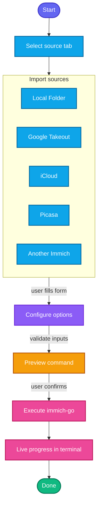

# Choose Your Workflow

Not sure which tab to open? Start here. Immich-Go GUI maps each use case to a specific immich-go subcommand so you do not have to memorize CLI flags.

## Operation Lifecycle



## Quick Decision Tree

```text
What do you want to do?
│
├─ Put media INTO Immich ─────────────────────────────── Upload
│   ├─ Photos already on disk / NAS / external drive ─── Upload → Folder
│   ├─ Google Takeout zip/folder export ──────────────── Upload → Google Photos
│   ├─ iCloud Photos export ──────────────────────────── Upload → iCloud
│   ├─ Picasa / legacy Google Photos export ──────────── Upload → Picasa
│   └─ Another Immich server (migration) ─────────────── Upload → Immich
│
├─ Export / reorganize media LOCALLY ─────────────────── Archive
│   ├─ Local folder → organized archive folder ───────── Archive → Folder
│   ├─ Google Takeout → local archive ────────────────── Archive → Google Photos
│   ├─ iCloud export → local archive ─────────────────── Archive → iCloud
│   ├─ Picasa export → local archive ─────────────────── Archive → Picasa
│   └─ Download from Immich to disk ──────────────────── Archive → Immich
│
└─ Group related assets already ON Immich ────────────── Stack
    (burst, RAW+JPEG, HEIC+JPEG, Epson FastFoto)
```

## Upload vs Archive vs Stack

| Goal | Section | Needs Immich server? | Result |
|------|---------|----------------------|--------|
| Import media **into** Immich | **Upload** | Yes (destination) | Assets appear in Immich |
| Copy/export media **to a local folder** | **Archive** | Usually no* | Files written on disk |
| Group related assets **already on the server** | **Stack** | Yes | Stacks created in Immich |

\* Archive from Immich is the exception: it needs a **source** Immich server.

## Common Recipes

### 1. First-time import from a photo drive

1. Config → set server URL + API key → **Test Connection**
2. Upload → **Folder**
3. Set source path (drag-and-drop works)
4. Optional: enable advanced mode for `folder-as-album` or date filters
5. Review preview → **Run**

See [Upload Workflows](upload-workflows.md#upload-from-folder).

### 2. Leave Google Photos for Immich

1. Create a [Google Takeout](https://takeout.google.com/) of Google Photos
2. Extract the archive so you have a folder of Takeout data
3. Upload → **Google Photos** → point at the Takeout folder
4. Keep album sync / partner / archived options as needed (advanced mode)
5. Prefer a dry run first on a small sample

See [Upload Workflows](upload-workflows.md#upload-from-google-photos).

### 3. Offline cleanup before uploading

Use **Archive** first when you want a clean local tree without touching Immich:

1. Archive → matching source tab (Folder / Google Photos / iCloud / Picasa)
2. Set **Write to folder**
3. Run dry run, then real archive
4. Later upload the cleaned archive with Upload → Folder

### 4. Migrate between Immich instances

1. Config tab = **destination** server + API key
2. Upload → **Immich**
3. Fill **From server** / **From API key** for the source
4. Filter with albums, tags, people, or date range if needed
5. Dry run, then full migration

See [Upload Workflows](upload-workflows.md#upload-from-immich).

### 5. Download a backup from Immich

1. Archive → **Immich**
2. Set source server credentials (not necessarily the Config-tab destination)
3. Choose write folder and filters
4. Run

See [Archive Workflows](archive-workflows.md#archive-from-immich).

### 6. Stack RAW + JPEG / bursts already uploaded

1. Config → server + API key
2. Stack tab → enable management options in advanced mode
3. Optional date range to limit scope
4. Dry run on a small window first

See [Stack](stack.md).

## When to Use Dry Run

Always dry-run when:

- You are unsure about filters or date ranges
- You enable stacking modes that can discard non-cover frames (`KeepJPG`, `KeepRaw`, burst stackers)
- You are migrating production libraries between Immich servers
- You just upgraded immich-go and want to confirm the command still looks right

Dry run still opens a terminal and runs immich-go — it just asks immich-go not to apply changes.

## Admin API Key: When Do You Need It?

| Situation | Admin API key needed? |
|-----------|------------------------|
| Normal upload / stack with job pausing **off** | No |
| Pause Immich background jobs during upload/stack (`pause-immich-jobs`) | **Yes** |
| Most read/write library operations with a user key | No |

If pausing is enabled but no Admin API key is set, the GUI **auto-disables** job pausing and shows a warning so uploads are not aborted with `403 Forbidden`. Details: [Configuration](configuration.md#admin-api-key-and-job-pausing).

## Profiles Tip

Create separate profiles for:

- Home vs work Immich servers
- Staging vs production
- Experiments with advanced flags (duplicate a known-good profile first)

See [Profiles](profiles.md).

## Next Steps

- [Getting Started](getting-started.md) — install and first run
- [Upload Workflows](upload-workflows.md)
- [Archive Workflows](archive-workflows.md)
- [FAQ](faq.md)
- [Troubleshooting](troubleshooting.md)
